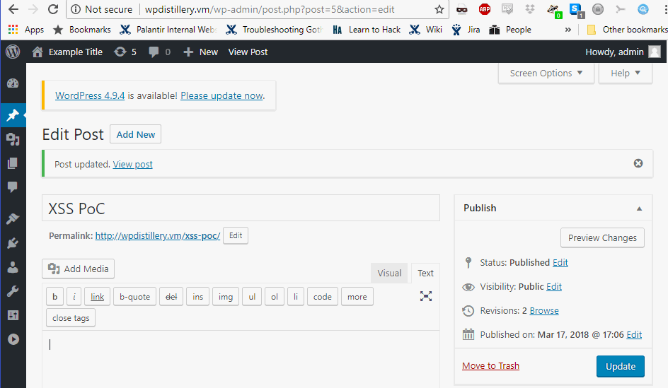
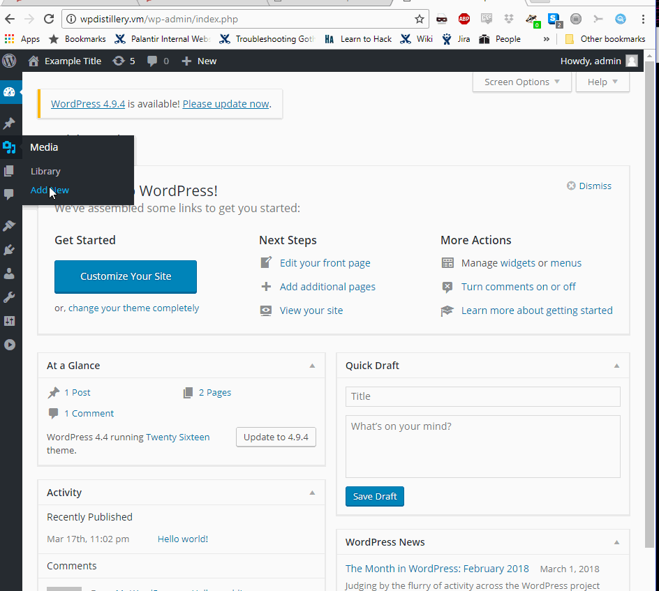
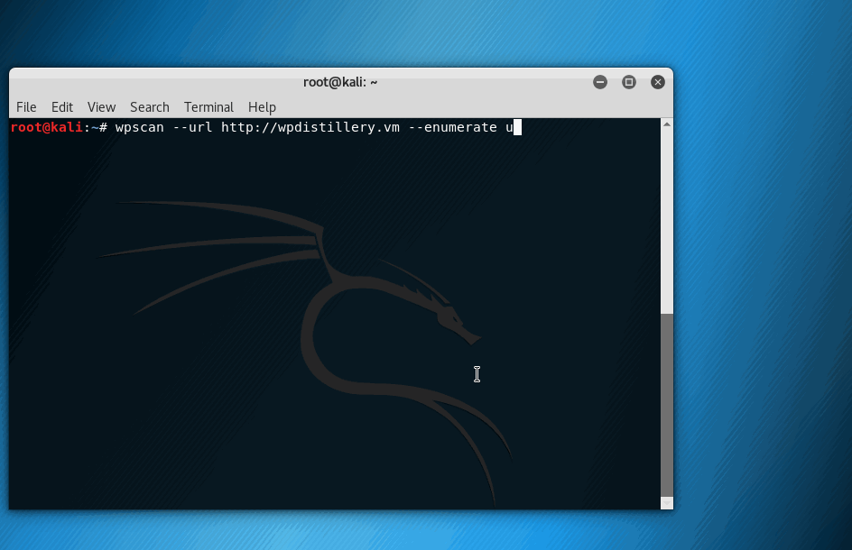

# Project 7 - WordPress Pentesting

Time spent: **12** hours spent in total

> Objective: Find, analyze, recreate, and document **five vulnerabilities** affecting an old version of WordPress

## Pentesting Report

1. CVE-2017-14726 - WordPress 4.2.3-4.8.1 - Authenticated Cross-Site Scripting (XSS) in Visual Editor
  - [x] Summary: Before version 4.8.2, WordPress was vulnerable to a cross-site scripting attack via shortcodes in the TinyMCE visual editor.
    - Vulnerability types: Cross-Site Scripting
    - Tested in version: 4.8
    - Fixed in version: 4.8.2
  - [x] GIF Walkthrough: 
  - [x] Steps to recreate: Create a new post. Use the 'text' editor, instead of visual editor, and inject XSS - as an example, use ``
  - [ ] Affected source code:
    - [Link 1](https://core.trac.wordpress.org/browser/trunk/src/wp-includes/js/mce-view.js?rev=41395)
    - [Link 2](https://core.trac.wordpress.org/browser/trunk/src/wp-includes/script-loader.php?rev=41395)
1. OVE-20160717-0003 - WordPress <=4.5.3 - WordPress audio playlist functionality is affected by Cross-Site Scripting
  - [x] Summary: A malicious MP3 file, uploaded to WordPress and used in a playlist, can trigger cross-site scripting.
    - Vulnerability types: Cross-Site Scripting
    - Tested in version: 4.4, 4.5.3
    - Fixed in version: 4.7.3
  - [x] GIF Walkthrough: 
  - [x] Steps to recreate: Upload malicious mp3 - https://www.securify.nl/advisory/SFY20160742/xss.mp3 for example - as media. Createa a new post. In the new post, create a playlist. Use malicious mp3 for playlist creation. Save the playlist, save the new post, and open the new post to view it. The XSS will execute.
  - [x] Affected source code:
    - [Link 1](https://core.trac.wordpress.org/browser/branches/4.4/src/wp-includes/media.php#L2062)
1. CVE-2017-5487 - WordPress <= 4.7 - WordPress username enumeration possible via REST API
  - [x] Summary: wp-includes/rest-api/endpoints/class-wp-rest-users-controller.php in the REST API implementation in WordPress 4.7 before 4.7.1 does not properly restrict listings of post authors, which allows remote attackers to obtain sensitive information via a wp-json/wp/v2/users request.
    - Vulnerability types: User Enumeration
    - Tested in version: 4.4, 4.5.3
    - Fixed in version: 4.7.1
  - [x] GIF Walkthrough: 
  - [x] Steps to recreate: Run `wpscan --url <WordPressURL> --enumerate u` against a vulnerable WordPress server. 
  - [x] Affected source code:
    - [Link 1](https://core.trac.wordpress.org/browser/branches/4.7/src/wp-includes/rest-api/endpoints/class-wp-rest-users-controller.php#L258)

## Assets

The only additional asset used in these penetration tests was the `wpscan` package - https://wpscan.org/

## Resources

- [WordPress Source Browser](https://core.trac.wordpress.org/browser/)
- [WordPress Developer Reference](https://developer.wordpress.org/reference/)

GIFs created with [LiceCap](http://www.cockos.com/licecap/).

## Notes

The most challenging thing encountered here was trying to reproduce reported issues written as problem descriptions, but without specifics. The Cross-Site Scripting exploits required changing some of how core WordPress was configured, because it was not displaying the pages I created.

## License

    Copyright [2018] [Ryan Fantus]

    Licensed under the Apache License, Version 2.0 (the "License");
    you may not use this file except in compliance with the License.
    You may obtain a copy of the License at

        http://www.apache.org/licenses/LICENSE-2.0

    Unless required by applicable law or agreed to in writing, software
    distributed under the License is distributed on an "AS IS" BASIS,
    WITHOUT WARRANTIES OR CONDITIONS OF ANY KIND, either express or implied.
    See the License for the specific language governing permissions and
    limitations under the License.
